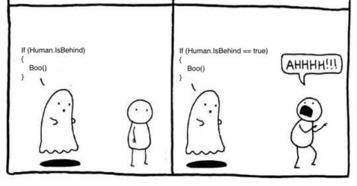
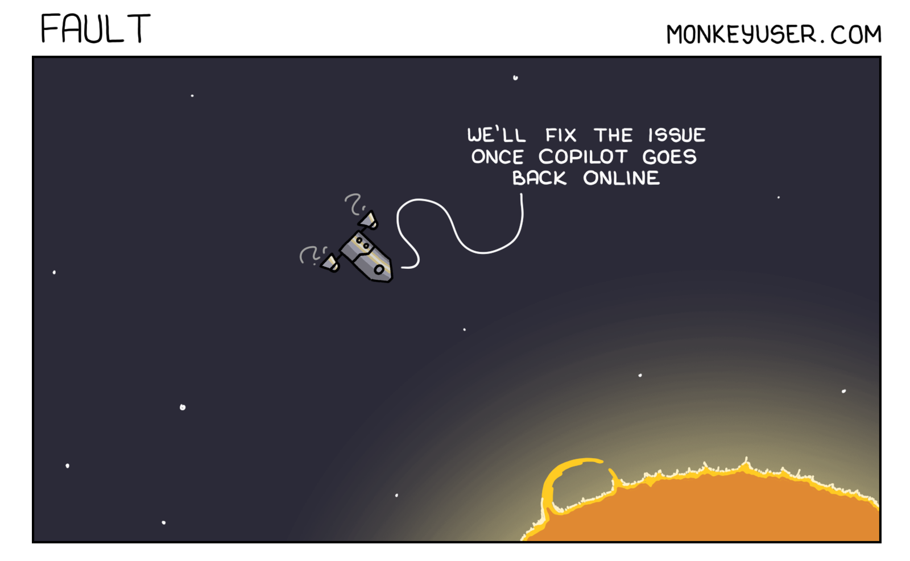

# Refatorando com github copilot agent

> copilot agent , uma ferramenta para automatizar tarefas repetitivas no desenvolvimento de software.

Existem diversas maneiras de usar o copilot, uma das mais comuns é o autocompletar, -- _utilizo há algum tempo e recomendo, só preste atenção ele pode recomendar alguns códigos estranhos_--. Apesar disso, o autocomplete é bastante eficiente para tarefas repetitivas, como geração de logs e testes unitários, especialmente quando sabemos o que deve ser implementado.

Outra forma interessante de uso é por meio de comentários com pequenas dicas, como o nome de um método ou um TODO. Nessas situações, o copilot faz sugestões bastante úteis.

Mais recentemente, foi lançado o **GitHub Copilot Agent**. Este novo modo permite que a ferramenta vá além das sugestões pontuais: ela pode editar múltiplos arquivos, entendendo o contexto do projeto e fazendo mudanças estruturais. O processo é interativo:

- Você descreve o que precisa ser feito;
- Adiciona arquivos ou diretórios no contexto que deseja alterar;
- Analisa os _diffs_ gerados;
- Revisa, adapta e decide se aceita ou rejeita as sugestões.

Neste post, vamos analisar a capacidade do Copilot Agent com as técnicas de refatoração do livro [Refatoração](https://refactoring.com/)

Refatorar significa melhorar a estrutura interna do código sem alterar seu comportamento. É também uma prática para manter a legibilidade, reduzir problemas técnicos e facilitar manutenções. A ideia é começar com tarefas pequenas preservando o funcionamento do código e evoluir para ratefas mais complexas.

## Sumário

1. [Refatorando](#1-refatorando)
2. [Resultados](#2-resultados)
3. [Conclusão](#3-conclusão)
4. [Referências](#4-referências)

---

## 1. Refatorando

Selecionamos funções python do repositório [_RefactoringGuru_](https://github.com/RefactoringGuru/refactoring-examples/tree/main/simple/python), que reúne exemplos práticos de código do livro Refatoração. A intenção desta etapa é avaliar a capacidade do Copilot em aplicar as técnicas de refatoração descritas no livro. Para isso, vamos comparar as sugestões do Copilot com as versões refatoradas manualmente disponíveis no próprio repositório.

1. **Isolamento do código original**  
   O código original foi organizado na pasta `python-before`.

2. **Lista de técnicas de refatoração**  
   Criamos um arquivo chamado _`refatoracoes_possiveis.txt`_, contendo uma lista de técnicas de refatoração.

3. **Uso do GitHub Copilot com GPT-4.1**  
   Para minimizar viés, a ordem das técnicas foi embaralhada e o código final manual (_`python-after`_) foi ocultado do modelo. O GitHub Copilot foi instruído com o seguinte contexto:

   - A lista de técnicas possíveis (_`refatoracoes_possiveis.txt`_)
   - O conteúdo da pasta _`python-before`_
   - Um prompt com as instruções:
     > _“Read each file under the folder 'codigos/python-before'. For each file you will generate a new file with suffix '\_copilot' with a refactoring suggestion. The refactoring must be one listed in the file 'refatoracoes_possiveis.txt'. You should write the refactoring name as a comment on the first line of the generated file.”_

## 2. Resultados

**Problema: reuso de variáveis temporárias:**

No código abaixo, a variável `temp` é usada para armazenar dois valores diferentes: o perímetro e área. Isso torna o código mais difícil de entender, especialmente porque o nome genérico da variável não revela seu propósito. Essa prática pode dificultar o processo de depuração, aumentar o risco de sobrescrita acidental e comprometer a legibilidade — além de violar o princípio de que cada variável deve ter uma única responsabilidade.

**Código antes:**

```python
    temp = 2 * (height + width)
    print(temp)
    temp = height * width
    print(temp)
```

#### Técnica: Split Temporary Variable

para o código acima a técnica aplicada pelo copilot foi _Split Temporary Variable_, evitando reuso e melhorando legibilidade do código.

**Código depois:**

```python
    # Split Temporary Variable
    perimeter = 2 * (height + width)
    print(perimeter)
    area = height * width
    print(area)
```

Neste exemplo, o copilot teve um bom desempenho, mantendo a mesma abordagem do [RefactoringGuru](https://github.com/RefactoringGuru/refactoring-examples/blob/main/simple/python/split-temporary-variable_after.py). A substituição da variável genérica `temp` por variáveis com nomes específicos, como `perimeter` e `area`, torna o código mais claro, e aderente às boas práticas de legibilidade e manutenção. Isso demonstra que, para refatorações pontuais e bem definidas, o copilot é um bom apoio no desenvolvimento.

**Problema: estruturas aninhadas:**

No cenário abaixo temos uma funcão com várias condicionais `if/elif` que tratam diferentes comportamentos de acordo com o tipo de `Bird`. Problema: essa classe dificulta manutenção, extensão do código, a organização do código em geral está confusa, e viola o princípio como o [Open/Closed Principle](https://en.wikipedia.org/wiki/Open%E2%80%93closed_principle).Em cenários reais, quando mais casos são adicionados, o método cresce e se torna mais difícil de testar e compreender isoladamente.

**Código antes:**

```python
class Bird:
    def getSpeed(self):
        if self.type == EUROPEAN:
            return self.getBaseSpeed()
        elif self.type == AFRICAN:
            return self.getBaseSpeed() - self.getLoadFactor() * self.numberOfCoconuts
        elif self.type == NORWEGIAN_BLUE:
            return 0 if self.isNailed else self.getBaseSpeed(self.voltage)
        else:
            raise Exception("Should be unreachable")
```


[Créditos aqui](https://refactoring.guru/smells/large-class)

#### Técnica: Replace Conditional With Polymorphism

A técnica _Replace Conditional With Polymorphism_ consiste em substituir estruturas condicionais, como `if/elif` por chamadas polimórficas, passando o comportamento específico para cada subclasse. Isso melhora a legibilidade e facilita a extensão do código.

**Código depois:**

```python
    class Bird:
        def getSpeed(self):
            raise NotImplementedError()

    class European(Bird):
        def getSpeed(self):
            return self.getBaseSpeed()

    class African(Bird):
        def getSpeed(self):
            return self.getBaseSpeed() - self.getLoadFactor() * self.numberOfCoconuts

    class NorwegianBlue(Bird):
        def getSpeed(self):
            return 0 if self.isNailed else self.getBaseSpeed(self.voltage)
```

Ao aplicar Replace Conditional With Polymorphism, o copilot implementa a substituição de condicionais por subclasses específicas para cada tipo de objeto, respeitando os princípios da técnica, a refatoração ficou muito próxima da indicada pelo [RefactoringGuru](https://github.com/RefactoringGuru/refactoring-examples/blob/main/simple/python/replace-conditional-with-polymorphism_after.py) .

#### Técnica: Substitute Algorithm em um código real e legado

Para explorar a capacidade do copilot em contextos reais, utilizamos o [BrainiakAPI](https://github.com/bmentges/brainiak_api), mais especificamente, uma função que trata da validação de tipos de propriedades de uma instância. O código original apresenta muitos blocos `if/elif` que verifica o tipo de cada propriedade.

Estruturas condicionais tornam o código repetitivo e aumentam a complexidade da função. Com a técnica **Substitute Algorithm**, vamos tentar melhorar a estrutura.
Estruturas condicionais tornam o código repetitivo e aumentam a complexidade da função. Com a técnica **Substitute Algorithm**, vamos tentar melhorar a estrutura.

**Código antes:**

```python
def validate_instance_properties_type(instance, props_type):
    for k, v in instance.items():
        if k in props_type["properties"]:
            if props_type["properties"][k]["type"] == "array":
                if not isinstance(v, list):
                    instance[k] = [v]
            elif props_type["properties"][k]["type"] == "string":
                if not isinstance(v, str):
                    instance[k] = str(v)
            elif props_type["properties"][k]["type"] == "number":
                if not isinstance(v, int):
                    instance[k] = int(v)
            elif props_type["properties"][k]["type"] == "boolean":
                if not isinstance(v, bool):
                    instance[k] = bool(v)

    return instance

```



[Créditos aqui](https://img.devrant.com/devrant/rant/r_1647754_X1Twj.jpg)

- prompt:
  > Refactor the validate_instance_properties_type function using the Substitute Algorithm technique. Ensure the refactored code preserves the original behavior and improves readability

**Código depois:**:

```python
def validate_instance_properties_type(instance, props_type):
    type_converters = {
        "array": lambda v: v if isinstance(v, list) else [v],
        "string": lambda v: v if isinstance(v, str) else str(v),
        "number": lambda v: v if isinstance(v, int) else int(v),
        "boolean": lambda v: v if isinstance(v, bool) else bool(v),
    }

    for k, v in instance.items():
        if k in props_type["properties"]:
            prop_type = props_type["properties"][k]["type"]
            if prop_type in type_converters:
                instance[k] = type_converters[prop_type](v)

    return instance

```

Na refatoração da função **validate_instance_properties_type**, o copilot substituiu um conjunto de estruturas `if-elif` por um dicionário que mapeia tipos e faz conversão. Essa mudança aplica a técnica **Substitute Algorithm**, isolando a lógica de conversão por tipo e deixa o código mais claro.

Neste exemplo, a função é a mesma, mas a refatoração torna a estrutura do método muito mais clara. Agora é possível identificar as etapas de mapeamento de tipos, conversão e iteração sobre os valores, que contribui para uma leitura mais rápida e manutenção mais segura do código.

### Refatorando multiplos arquivos com o Copilot Agent

E para testar o agent, refatoramos um _handler_ responsável pela comunicação entre uma API e dois bancos de dados: Neptune e Elasticsearch, além de outras funcionalidades auxiliares.

O objetivo da refatoração era eliminar a dependência do banco Neptune, mantendo apenas o Elasticsearch.


[Créditos aqui](https://refactoring.guru/smells/dead-code)

A primeira interação com o Copilot Agent foi:

> **Refatore o `InstanceHandlerES` removendo a comunicação com Neptune.**

Durante esse processo, o copilot analisou o arquivo e removeu as chamadas e importações relacionadas ao Neptune.


Depois de aceitar as sugestões, passamos um novo pedido:

> **Revise todos os arquivos da pasta `brainiak` e remova as dependências do Neptune.**

Esse segundo passo envolveu alterações em 14 arquivos diferentes. O copilot identificou e editou os pontos de dependência distribuídos no projeto.


A refatoração resultou na remoção de uma grande quantidade de código, o que exigiu uma revisão cuidadosa. Como esperado, alguns testes falharam após as mudanças, e durante a análise, identificamos que ainda restavam algumas referências ao Neptune, o que exigiu instruções adicionais para fazer a remoção completa.


[Créditos aqui](https://www.monkeyuser.com/tags/refactor/)

Aqui vale destacar que as refatorações da API não foram aplicadas em produção. Elas foram feitas com o objetivo de avaliar a capacidade do copilot em lidar com mudanças estruturais em múltiplos arquivos. Apesar do sucesso da refatoração, seria necessário também atualizar os testes dos arquivos alterados para garantir que nenhum problema foi causado.

**Problema: uso desnecessário de variável temporária:**

No código original, a função calculateTotal utiliza uma variável temporária chamada basePrice apenas para armazenar o resultado de uma expressão que poderia ser calculada diretamente (quantity * itemPrice). Esse uso é redundante e pode ser substituído por uma query que encapsula a lógica, melhorando a clareza e a coesão do código.

**Código original:**

```python
    def calculateTotal():
        basePrice = quantity * itemPrice
        if basePrice > 1000:
            return basePrice * 0.95
        else:
            return basePrice * 0.98
```

#### Técnica: Replace Temp With Query

O copilot utilizou a técnica Replace Temp With Query, substituindo a variável basePrice diretamente pela expressão lógica.

**Código refatorado:**

```python
    # Replace Temp With Query
    def calculateTotal():
        if quantity * itemPrice > 1000:
            return quantity * itemPrice * 0.95
        else:
            return quantity * itemPrice * 0.98
```

Apesar do copilot substituir corretamente a variável basePrice pela expressão lógica, falhou em encapsular essa lógica em um método que poderia ser reutilizado no código, como é indicado pelo [RefactoringGuru](https://github.com/RefactoringGuru/refactoring-examples/blob/main/simple/python/replace-temp-with-query_after.py). Isso mostra que o Copilot foi capaz de compreender o problema da variável temporária, mas não soube propor a melhor abstração para legibilidade e manutenção.

**Problema: uso de número mágico no código:**

No código original, a constante 9.81 aparece de forma "solta" dentro da fórmula de cálculo da energia potencial. Esse valor representa a aceleração gravitacional na Terra, mas como está escrito diretamente no cálculo, é conhecido como **número mágico** - um valo numérico usado sem contexto explícito. Esse tipo de prática prejudica a legibilidade, dificulta manutenção e reutilização desse valor além de reduz a clareza semântica do código.

**Código original:**

```python
    def potentialEnergy(mass, height):
        return mass * height * 9.81
```

#### Técnica: Replace Magic Number With Symbolic Constant

O Copilot utilizou a técnica Replace Magic Number With Symbolic Constant, atrelando o valor da aceleração gravitacional na Terra à variável GRAVITY.

**Código refatorado:**

```python
    # Replace Magic Number With Symbolic Constant
    GRAVITY = 9.81


    def potentialEnergy(mass, height):
        return mass * height * GRAVITY
```

O Copilot foi capaz de aplicar corretamente a técnica Replace Magic Number With Symbolic Constant e seu código difere do proposto pelo [RefactoringGuru](https://github.com/RefactoringGuru/refactoring-examples/blob/main/simple/python/replace-magic-number-with-symbolic-constant_after.py) apenas no nome da variável, enquanto o primeiro utilizou o nome GRAVITATIONAL_CONSTANT, o Copilot escolheu GRAVITY, sendo que ambos são válidos e descritivos do valor armazenado.

**Problema: bloco de código que mistura responsabilidades:**

No código original, o método printOwing realiza duas tarefas: exibe um banner e imprime os detalhes do cliente (nome e valor devido). Esse tipo de método com múltiplas responsabilidades prejudica a legibilidade e dificulta testes e manutenção.

**Código original:**

```python
    def printOwing(self):
        self.printBanner()

        # print details
        print("name:", self.name)
        print("amount:", self.getOutstanding())
```

#### Técnica: Extract Method

O Copilot aplicou a técnica Extract Method, encapsulando os prints em um novo método printDetails.

**Código refatorado:**

```python
    # Extract Method
    def printOwing(self):
        self.printBanner()
        self.printDetails()


    def printDetails(self):
        print("name:", self.name)
        print("amount:", self.getOutstanding())
```

O Copilot aplicou corretamente a técnica Extract Method mas seu código difere do proposto pelo [RefactoringGuru](https://github.com/RefactoringGuru/refactoring-examples/blob/main/simple/python/extract-method_after.py), pois enquanto o Guru extraiu o valor retornado por getOutstanding() passando como argumento para printDetails, o Copilot manteve o cálculo dentro do novo método, o que reduz a flexibilidade e dificulta o resuo do método extraído. Ainda assim o Copilot demonstrou boa capacidade em detectar e isolar responsabilidades.


## 3. Conclusão

O modo **Agent** demonstrou boa capacidade de entender o contexto das tarefas e se mostrou eficaz para aumentar a produtividade e automatizar tarefas repetitivas.



[Créditos aqui](https://www.monkeyuser.com/tags/refactor/)

Ao aplicarmos todas as técnicas listadas em `refatoracoes_possiveis.txt`, observamos um bom desempenho na execução das refatorações. A planilha `copilot_x_especialista.xlsx` compara os resultados obtidos pelo copilot com versões refatoradas manualmente.

As divergências identificadas entre as abordagens concentram-se, principalmente, na interpretação da intenção da refatoração. Enquanto a versão manual tende a demonstrar a técnica de forma conceitual (sem a preocupação de completar o código), o copilot tentou tornar o código executável. Por exemplo, ao identificar a ausência de um `return`, o modelo entendeu como um erro e fez ajuestes.

## 4. Referências

- [Refactoring.com (Martin Fowler)](https://refactoring.com/)
- [Copilot Agent](https://docs.github.com/en/copilot)
- [AI-Driven Code Optimization](https://najer.org/najer/article/view/115/121)
- [Leveraging LLMs for Legacy Code Modernization](https://arxiv.org/abs/2411.14971)
- [An Empirical Study on the Potential of LLMs in Automated Software Refactoring](https://arxiv.org/abs/2411.04444)
- [Using Large Language Models to Re-Engineer a Legacy System](https://ieeexplore.ieee.org/abstract/document/10992377)
- [Exploring GenAI](https://martinfowler.com/articles/exploring-gen-ai/11-multi-file-editing.html)
