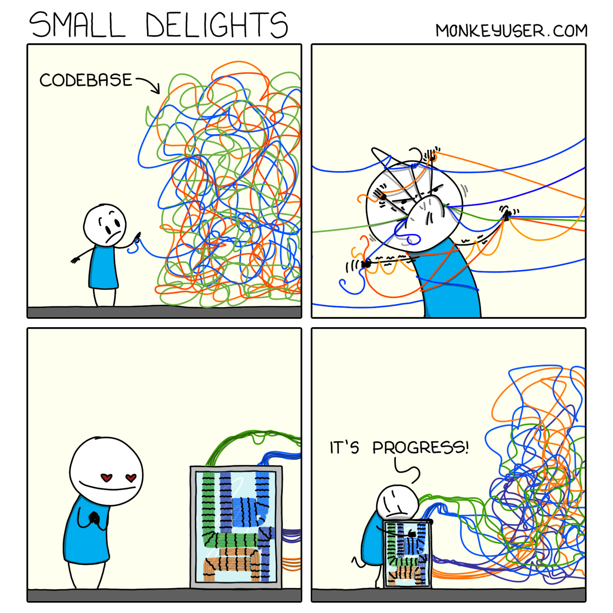
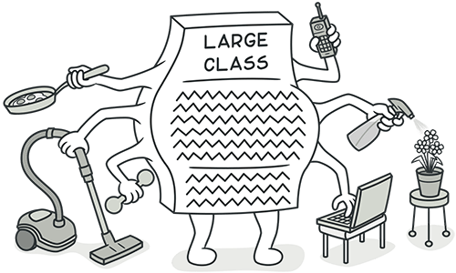
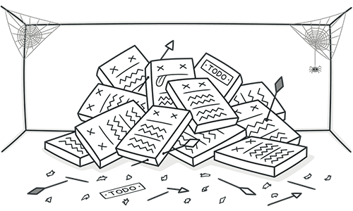
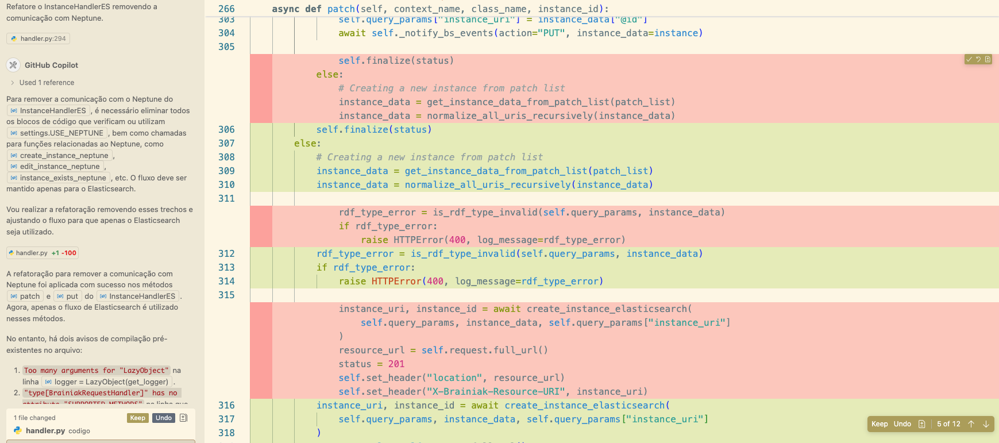

# Refatorando com github copilot agent

> copilot agent , uma ferramenta para automatizar tarefas repetitivas no desenvolvimento de software.



[Créditos aqui](https://www.monkeyuser.com/tags/refactor/)

> Este artigo foi desenvolvido como parte da disciplina **Metodologias Ágeis para o Desenvolvimento de Software**, oferecida no [Programa de Pós-Graduação em Computação Aplicada (PPGCA) da **UTFPR**](https://www.utfpr.edu.br/cursos/programas-de-pos-graduacao/ppgca-ct), ministrada pelo Professor [Adolfo Neto](https://adolfont.github.io/). Os autores são [Ana Schwaab](https://github.com/anaschwaab) e [Derli Machado](https://github.com/derliaparecida).

Neste trabalho, exploramos o uso do GitHub Copilot Agent (v 1.336.0) como ferramenta de apoio à refatoração de código. Combinando teoria e prática, avaliamos a eficácia do agente em aplicar técnicas clássicas de refatoração descritas no livro [Refatoração](https://refactoring.com/) de Martin Fowler. Para isso, utilizamos trechos de código representativos de problemas comuns no desenvolvimento de software, além de aplicar a ferramenta em um cenário real: a refatoração de uma API com múltiplos arquivos. O objetivo é entender o potencial dessas ferramentas baseadas em modelos de linguagem para apoiar a manutenção e evolução de sistemas.

Existem diversas maneiras de usar o copilot, uma das mais comuns é o autocompletar, _utilizo há algum tempo e recomendo, só preste atenção, pois ele pode recomendar alguns códigos estranhos_. Apesar disso, o autocomplete é bastante eficiente para tarefas repetitivas, como geração de logs e testes unitários, especialmente quando sabemos o que deve ser implementado. Essa eficiência, inclusive, já é demonstrada por estudos recentes que mostram que o uso de LLMs para sugestões de código pode aumentar significativamente a produtividade e reduzir erros em tarefas de baixa complexidade [(Vaithilingam et al., 2022](https://www.researchgate.net/publication/360267490_Expectation_vs_Experience_Evaluating_the_Usability_of_Code_Generation_Tools_Powered_by_Large_Language_Models); [Jaffe et al., 2024)](https://www.microsoft.com/en-us/research/wp-content/uploads/2024/07/Generative-AI-in-Real-World-Workplaces.pdf).

Outra forma interessante de uso é por meio de comentários com pequenas dicas, como o nome de um método ou um TODO. Nessas situações, o copilot faz sugestões bastante úteis.

Mais recentemente, essas capacidades foram ampliadas com a introdução do **GitHub Copilot Agent**. Este novo modo permite que a ferramenta vá além das sugestões pontuais: ela pode editar múltiplos arquivos, entendendo o contexto do projeto e fazendo mudanças estruturais.

Esse avanço amplia o potencial de uso de LLMs em tarefas mais sofisticadas, como a refatoração de código. Refatorar significa melhorar a estrutura interna do código sem alterar seu comportamento, um conceito central na engenharia de software que tem sido explorado com LLMs como ferramenta de apoio [(Kass, 2025)](https://www.authorea.com/doi/full/10.22541/au.174768395.52918781). É também uma prática para manter a legibilidade, reduzir problemas técnicos e facilitar manutenções. A ideia é começar com tarefas pequenas preservando o funcionamento do código e evoluir para ratefas mais complexas.

Ainda que com limitações em segurança e precisão, a capacidade de LLMs de identificar e aplicar refatorações automaticamente já foi demonstrada em estudos recentes [(Liu et al., 2023)](https://www.researchgate.net/publication/385629991_An_Empirical_Study_on_the_Potential_of_LLMs_in_Automated_Software_Refactoring). O processo é interativo:

- Você descreve o que precisa ser feito;
- Adiciona arquivos ou diretórios no contexto que deseja alterar;
- Analisa os _diffs_ gerados;
- Revisa, adapta e decide se aceita ou rejeita as sugestões.

Para realizar esse processo, primeiro passamos para o Copilot uma lista de técnicas de refatoração e analisamos alguns exemplos da lista. Os demais casos são resumidos em uma tabela, mostrando acertos e erros. Para testar a ferramenta em um cenário real, usamos a [API](<(https://github.com/bmentges/brainiak_api)>) e aplicamos a refatoração para remover a integração com um banco de dados.

## Sumário

1. [Como estruturamos os testes](#1-como-estruturamos-os-testes)
2. [Análise das refatorações](#2-análise-das-refatorações)
3. [Conclusão](#3-conclusão)
4. [Referências](#4-referências)

---

## 1. Como estruturamos os testes

1. **Isolamento do código original**  
   O código original foi organizado na pasta `python-before`.

2. **Lista de técnicas de refatoração**  
   Criamos um arquivo chamado _`refatoracoes_possiveis.txt`_, contendo uma lista de técnicas de refatoração.

3. **Uso do GitHub Copilot com GPT-4.1**  
   Para minimizar viés, a ordem das técnicas foi embaralhada e o código final manual (_`python-after`_) foi ocultado do modelo. O GitHub Copilot foi instruído com o seguinte contexto:

   - A lista de técnicas possíveis (_`refatoracoes_possiveis.txt`_)
   - O conteúdo da pasta _`python-before`_
   - Um prompt com as instruções:
     > _“Read each file under the folder 'codigos/python-before'. For each file you will generate a new file with suffix '\_copilot' with a refactoring suggestion. The refactoring must be one listed in the file 'refatoracoes_possiveis.txt'. You should write the refactoring name as a comment on the first line of the generated file.”_

## 2. Análise das refatorações

### 2.1 Análises de exemplos de código do RefactoringGuru

Selecionamos funções python do repositório [_RefactoringGuru_](https://github.com/RefactoringGuru/refactoring-examples/tree/main/simple/python), que reúne exemplos práticos de código do livro Refatoração.A intenção desta etapa é avaliar a capacidade do Copilot em aplicar as técnicas de refatoração descritas no livro. Para isso, vamos comparar as sugestões do Copilot com as versões refatoradas manualmente disponíveis no próprio repositório.

#### 2.1.1 Split Temporary Variable: substituindo variável com múltiplos usos

No código abaixo, a variável `temp` é usada para armazenar dois valores: o perímetro e área. Isso torna o código mais difícil de entender, especialmente porque o nome genérico da variável não revela seu propósito. Essa prática pode dificultar o processo de depuração, aumentar o risco de sobrescrita do valor e compromete a legibilidade — além de violar o princípio de responsabilidade única.

**Código original:**

```python
    temp = 2 * (height + width)
    print(temp)
    temp = height * width
    print(temp)
```

A técnica aplicada pelo copilot está correta, evitando reuso e melhorando legibilidade do código.

**Código refatorado:**

```python
    # Split Temporary Variable
    perimeter = 2 * (height + width)
    print(perimeter)
    area = height * width
    print(area)
```

Neste exemplo, o copilot teve um bom desempenho, manteve a mesma abordagem do [RefactoringGuru](https://github.com/RefactoringGuru/refactoring-examples/blob/main/simple/python/split-temporary-variable_after.py). A substituição da variável genérica `temp` por variáveis com nomes específicos, torna o código mais claro, o nome de variáveis devem refletir o valor que armazenam[CleanCode](clencode).

#### 2.1.2 Replace Conditional With Polymorphism: delegando lógica específica para subclasses

No cenário abaixo temos uma funcão com várias condicionais `if/elif` que tratam diferentes comportamentos de acordo com o tipo de `Bird`. Problema: essa classe dificulta manutenção, extensão do código, a organização do código em geral está confusa, e viola o princípio como o [Open/Closed Principle](https://en.wikipedia.org/wiki/Open%E2%80%93closed_principle).Em cenários reais, quando mais casos são adicionados, o método cresce e se torna mais difícil de testar e compreender isoladamente.

**Código original:**

```python
class Bird:
    def getSpeed(self):
        if self.type == EUROPEAN:
            return self.getBaseSpeed()
        elif self.type == AFRICAN:
            return self.getBaseSpeed() - self.getLoadFactor() * self.numberOfCoconuts
        elif self.type == NORWEGIAN_BLUE:
            return 0 if self.isNailed else self.getBaseSpeed(self.voltage)
        else:
            raise Exception("Should be unreachable")
```



[Créditos aqui](https://refactoring.guru/smells/large-class)

A técnica acima consiste em substituir estruturas condicionais, como `if/elif` por chamadas polimórficas, passando o comportamento específico para cada subclasse. Isso melhora a legibilidade e facilita a extensão do código.

**Código refatorado:**

```python
    class Bird:
        def getSpeed(self):
            raise NotImplementedError()

    class European(Bird):
        def getSpeed(self):
            return self.getBaseSpeed()

    class African(Bird):
        def getSpeed(self):
            return self.getBaseSpeed() - self.getLoadFactor() * self.numberOfCoconuts

    class NorwegianBlue(Bird):
        def getSpeed(self):
            return 0 if self.isNailed else self.getBaseSpeed(self.voltage)
```

O copilot implementa a substituição de condicionais por subclasses específicas para cada tipo de objeto, respeitando os princípios da técnica, a refatoração ficou muito próxima da indicada pelo [RefactoringGuru](https://github.com/RefactoringGuru/refactoring-examples/blob/main/simple/python/replace-conditional-with-polymorphism_after.py).

#### 2.1.3 Replace Temp With Query: removendo variáveis temporárias desnecessárias

No código original, a função calculateTotal utiliza uma variável temporária chamada basePrice apenas para armazenar o resultado de uma expressão que poderia ser calculada diretamente (quantity \* itemPrice). Esse uso é redundante e pode ser substituído por uma query que encapsula a lógica, melhorando a clareza e a coesão do código.

**Código original:**

```python
    def calculateTotal():
        basePrice = quantity * itemPrice
        if basePrice > 1000:
            return basePrice * 0.95
        else:
            return basePrice * 0.98
```

O copilot utilizou a técnica Replace Temp With Query, substituindo a variável basePrice diretamente pela expressão lógica.

**Código refatorado:**

```python
    # Replace Temp With Query
    def calculateTotal():
        if quantity * itemPrice > 1000:
            return quantity * itemPrice * 0.95
        else:
            return quantity * itemPrice * 0.98
```

Apesar do copilot substituir corretamente a variável basePrice pela expressão lógica, falhou em encapsular essa lógica em um método que poderia ser reutilizado no código, como é indicado pelo [RefactoringGuru](https://github.com/RefactoringGuru/refactoring-examples/blob/main/simple/python/replace-temp-with-query_after.py). Isso mostra que o Copilot foi capaz de compreender o problema da variável temporária, mas não soube propor a melhor abstração para legibilidade e manutenção.

#### 2.1.4 Replace Magic Number With Symbolic Constant: dando significado a números "mágicos"

No código original, a constante 9.81 aparece de forma "solta" dentro da fórmula de cálculo da energia potencial. Esse valor representa a aceleração gravitacional na Terra, mas como está escrito diretamente no cálculo, é conhecido como **número mágico** - um valo numérico usado sem contexto explícito. Esse tipo de prática prejudica a legibilidade, dificulta manutenção e reutilização desse valor além de reduz a clareza semântica do código.

**Código original:**

```python
    def potentialEnergy(mass, height):
        return mass * height * 9.81
```

O Copilot utilizou a técnica Replace Magic Number With Symbolic Constant, atrelando o valor da aceleração gravitacional na Terra à variável GRAVITY.

**Código refatorado:**

```python
    # Replace Magic Number With Symbolic Constant
    GRAVITY = 9.81


    def potentialEnergy(mass, height):
        return mass * height * GRAVITY
```

O Copilot foi capaz de aplicar corretamente a técnica Replace Magic Number With Symbolic Constant e seu código difere do proposto pelo [RefactoringGuru](https://github.com/RefactoringGuru/refactoring-examples/blob/main/simple/python/replace-magic-number-with-symbolic-constant_after.py) apenas no nome da variável, enquanto o primeiro utilizou o nome GRAVITATIONAL_CONSTANT, o Copilot escolheu GRAVITY, sendo que ambos são válidos e descritivos do valor armazenado.

#### 2.1.5 Extract Method: separando blocos com responsabilidades distintas

No código original, o método printOwing realiza duas tarefas: exibe um banner e imprime os detalhes do cliente (nome e valor devido). Esse tipo de método com múltiplas responsabilidades prejudica a legibilidade e dificulta testes e manutenção.

**Código original:**

```python
    def printOwing(self):
        self.printBanner()

        # print details
        print("name:", self.name)
        print("amount:", self.getOutstanding())
```

O Copilot aplicou a técnica Extract Method, encapsulando os prints em um novo método printDetails.

**Código refatorado:**

```python
    # Extract Method
    def printOwing(self):
        self.printBanner()
        self.printDetails()


    def printDetails(self):
        print("name:", self.name)
        print("amount:", self.getOutstanding())
```

O Copilot aplicou corretamente a técnica Extract Method mas seu código difere do proposto pelo [RefactoringGuru](https://github.com/RefactoringGuru/refactoring-examples/blob/main/simple/python/extract-method_after.py), pois enquanto o Guru extraiu o valor retornado por getOutstanding() passando como argumento para printDetails, o Copilot manteve o cálculo dentro do novo método, o que reduz a flexibilidade e dificulta o resuo do método extraído. Ainda assim o Copilot demonstrou boa capacidade em detectar e isolar responsabilidades.

## 2.2 Refatoração de API alterando multiplos arquivos

Para explorar a capacidade do copilot em contextos reais, utilizamos o [BrainiakAPI](https://github.com/bmentges/brainiak_api), uma API da [Globo]() voltada para manipulação de dados semânticos por meio de rotas REST. Ela oferece suporte a operações como CRUD, permalinks, buscas, sugestões e consultas parametrizadas, além de permitir a integração com múltiplas ontologias e bancos como Elasticsearch e Neptune.

Neste exemplo, começamos com uma função responsável por validar os tipos das propriedades de uma instância. O código original possui diversos blocos `if/elif` que verificam os tipos esperados, tornando a função extensa e repetitiva.

**Código original:**

```python
def validate_instance_properties_type(instance, props_type):
    for k, v in instance.items():
        if k in props_type["properties"]:
            if props_type["properties"][k]["type"] == "array":
                if not isinstance(v, list):
                    instance[k] = [v]
            elif props_type["properties"][k]["type"] == "string":
                if not isinstance(v, str):
                    instance[k] = str(v)
            elif props_type["properties"][k]["type"] == "number":
                if not isinstance(v, int):
                    instance[k] = int(v)
            elif props_type["properties"][k]["type"] == "boolean":
                if not isinstance(v, bool):
                    instance[k] = bool(v)

    return instance

```

- prompt:
  > Refactor the validate_instance_properties_type function using the Substitute Algorithm technique. Ensure the refactored code preserves the original behavior and improves readability

**Código refatorado:**

```python
def validate_instance_properties_type(instance, props_type):
    type_converters = {
        "array": lambda v: v if isinstance(v, list) else [v],
        "string": lambda v: v if isinstance(v, str) else str(v),
        "number": lambda v: v if isinstance(v, int) else int(v),
        "boolean": lambda v: v if isinstance(v, bool) else bool(v),
    }

    for k, v in instance.items():
        if k in props_type["properties"]:
            prop_type = props_type["properties"][k]["type"]
            if prop_type in type_converters:
                instance[k] = type_converters[prop_type](v)

    return instance

```

### Substitute Algorithm

Na refatoração da função **validate_instance_properties_type**, o copilot substituiu um conjunto de estruturas `if-elif` por um dicionário que mapeia tipos e faz conversão. Essa mudança aplica a técnica **Substitute Algorithm**, isolando a lógica de conversão por tipo e deixa o código mais claro.

Neste exemplo, a função é a mesma, mas a refatoração torna a estrutura do método muito mais clara. Agora é possível identificar as etapas de mapeamento de tipos, conversão e iteração sobre os valores, que contribui para uma leitura mais rápida e manutenção mais segura do código.

### 2.3 Removendo a integração com um Banco de Dados

Vamos remover uma funcionalidade de dentro de um _handler_ . No arquivo `handler-antes.py`, temos um trecho de código responsável por gerenciar a comunicação entre dois bancos de dados: [Neptune](https://docs.aws.amazon.com/neptune/) e [Elasticsearch](https://www.elastic.co/elasticsearch). Na Globo, o Neptune é utilizado para armazenar dados em grafo, seguindo o modelo [RDF](https://www.w3.org/RDF/). Já o Elasticsearch é usado para buscas rápidas e indexação de dados.

Esse handler é responsável por manter a consistência entre os dois bancos, garantindo que as operações reflitam em ambas as bases. Nosso objetivo é remover a lógica relacionada ao Neptune, mantendo apenas a comunicação com o Elasticsearch.



[Créditos aqui](https://refactoring.guru/smells/dead-code)

A primeira interação com o Copilot Agent foi:

> **Refatore o `InstanceHandlerES` removendo a comunicação com Neptune.**

Durante esse processo, o copilot analisou o arquivo e removeu as chamadas e importações relacionadas ao Neptune.



Depois de aceitar as sugestões, passamos um novo pedido:

> **Revise todos os arquivos da pasta `brainiak` e remova as dependências do Neptune.**

Esse segundo passo envolveu alterações em 14 arquivos diferentes. O copilot identificou e editou os pontos de dependência distribuídos no projeto.


A refatoração resultou na remoção de uma grande quantidade de código, o que exigiu uma revisão cuidadosa. Como esperado, alguns testes falharam após as mudanças, e durante a análise, identificamos que ainda restavam algumas referências ao Neptune, o que exigiu instruções adicionais para fazer a remoção completa.

E por que remover o Neptune?

A decisão de remover o Neptune da aplicação faz parte de uma estratégia de modernização da infraestrutura semântica da Globo. Atualmente, temos cerca de 15 grafos que sustentam páginas como o [Tudo Sobre](https://g1.globo.com/tudo-sobre/ministerio-da-justica-e-seguranca-publica/), e enriquecem conteúdos em produtos como o [G1](https://g1.globo.com/mundo/noticia/2025/06/17/quem-era-ali-shadmani-lider-militar-iraniano-que-israel-anunciou-ter-matado.ghtml), conectando entidades e temas relacionados. Por um bom tempo, o Neptune foi o banco usado para manter a base semântica, mas a aplicação foi ganhando novas responsabilidades:`ifs, elses e mais ifs`, e com isso 2 problemas foram centrais para a mudança: custo do banco e manutenção da API.

Diante disso, decidimos repensar a semântica Globo, e estamos no processo de reestruturação — avaliando outros formatos, como taxonomias ou vocabulários controlados — e enquanto pensamos, optamos por manter apenas o Elasticsearch, que já está integrado à API. A estratégia adotada foi a migração por paths, onde as queries [SPARQL](https://www.w3.org/TR/sparql11-query/) foram substituídas por consultas adaptadas para o ES, e este foi o primeiro passo da reestruturação semantica.

## 3. Conclusão

O modo **Agent** demonstrou boa capacidade de entender o contexto das tarefas e se mostrou eficaz para aumentar a produtividade e automatizar tarefas repetitivas.

Ao aplicarmos todas as técnicas listadas em `refatoracoes_possiveis.txt`, observamos um bom desempenho na execução das refatorações. A planilha `copilot_x_especialista.xlsx` compara os resultados obtidos pelo copilot com versões refatoradas manualmente.

As divergências identificadas entre as abordagens concentram-se, principalmente, na interpretação da intenção da refatoração. Enquanto a versão manual tende a demonstrar a técnica de forma conceitual (sem a preocupação de completar o código), o copilot tentou tornar o código executável. Por exemplo, ao identificar a ausência de um `return`, o modelo entendeu como um erro e fez ajuestes.

## 4. Saiba Mais

- [Refactoring.com (Martin Fowler)](https://refactoring.com/) — Livro do Martin Fowler sobre refatoração de código. Tenho esse livro há bastante tempo e sempre recorro a ele quando me deparo com um código difícil de alterar. Na primeira vez em que li, foi uma leitura contínua, passando pelas técnicas e tentando entender o que estava acontecendo. Com um pouco mais de experiência, sempre que encontro um código complicado, lembro e uso o livro como referência para refatorar.

- [GitHub Copilot Agent](https://docs.github.com/en/copilot) — Documentação oficial do Copilot. Aqui você vai encontrar exemplos práticos, explicações sobre as funcionalidades e orientações de como usar a ferramenta.

- [AI-Driven Code Optimization](https://najer.org/najer/article/view/115/121) — Este artigo fala do uso de IA para otimização de código legado.

- [Leveraging LLMs for Legacy Code Modernization](https://arxiv.org/abs/2411.14971) — Este artigo analisa como LLMs podem ajudar na documentação de sistemas legados escritos em linguagens obsoletas como MUMPS e Assembly para mainframe.

- [An Empirical Study on the Potential of LLMs in Automated Software Refactoring](https://arxiv.org/abs/2411.04444) — Estudo sobre o desempenho LLMs em tarefas de refatoração.

- [Using Large Language Models to Re-Engineer a Legacy System](https://ieeexplore.ieee.org/abstract/document/10992377) — Reengenharia de sistema legado com LLMs.

- [Exploring GenAI: Multi-file Editing](https://martinfowler.com/articles/exploring-gen-ai/11-multi-file-editing.html) — Este post faz parte de uma série posts, feitos para explorar a capacidade de agents para tarefas de desenvolvimento.
